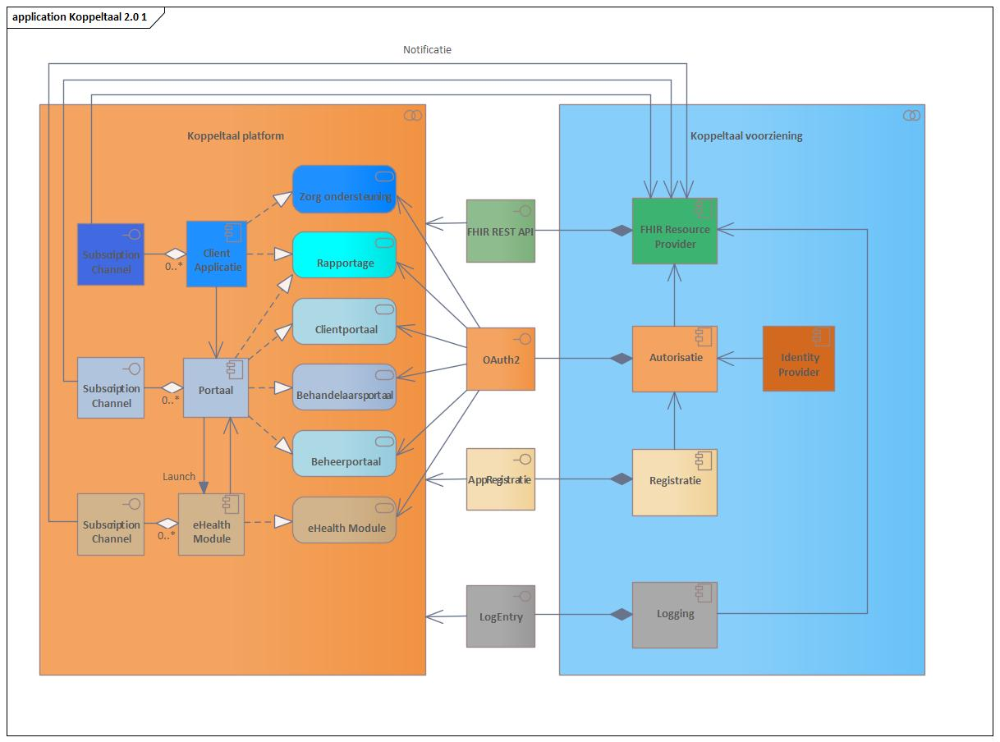
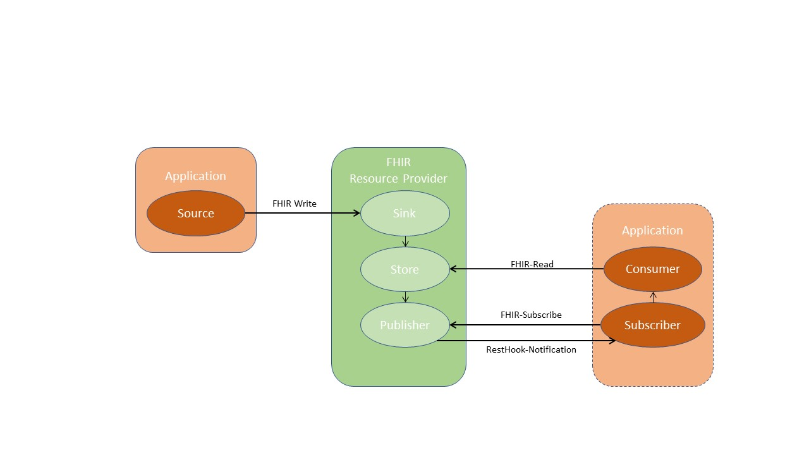

# Informatiesysteem architectuur

## Systeemcomponenten

In de doelstelling van stichting Koppeltaal is middels het woord ‘interne’ een beperking voor de gegevensuitwisseling opgenomen. Met deze beperking wordt bedoeld dat de gegevensuitwisseling altijd plaatsvindt onder de verantwoordelijkheid van één **zorgaanbieder.** In de Koppeltaal architectuur is daarom gekozen voor het concept **domein.** Een domein, in Koppeltaal, is synoniem aan een zorgaanbieder, en beperkt de gegevensuitwisseling tot _interne gegevensuitwisseling_ onder verantwoordelijkheid van de betreffende zorgaanbieder.

De gegevensuitwisseling vindt plaats tussen **systeemcomponenten**. In Koppeltaal staat het **systeem component** voor alle vormen van informatiesystemen \(zoals zorg ondersteuning, portalen en eHealth modules\) in de context van een Koppeltaal platform die voor de zorgaanbieder relevant zijn om gegevens tussen uit te wisselen.

Koppeltaal 2.0 bestaat uit de volgende componenten en collaboraties:

* "Koppeltaal voorziening" : Alle producten en diensten die nodig zijn om de informatiestromen tussen \(zorg\) toepassingen op een veilige manier tot stand te brengen in de context van "Blended Care" \(combinatie tussen traditionele therapie en digitale therapie/interventies\)  
* "Koppeltaal platform" : Een platform geeft toegang tot een palet aan gestandaardiseerde informatiesystemen en technologie. Het platform kan gebruik maken van, of diensten verlenen aan een applicatie of eHealth module.  
* "Portaal" : Een toegangspoort of -\(verzamel\)punt tot informatie over een bepaald onderwerp die een gebruiker een uniforme toegang biedt naar achterliggende systeem componenten. Het kan ook worden beschouwd als een bibliotheek met gepersonaliseerde en gecategoriseerde inhoud voor een groep personen die toegang krijgen tot functionaliteiten over of het gebruik van activiteiten. Een portaal handelt HTTP berichten af.
* "Client Applicatie":  Is software die een dienst afneemt in het zorgproces en die informatie opvraagt en verstrekt middels een dienst.  
* "eHealth Module":  Software dat een eHealth toepassing \(dienstverlening\) is, zonder tussenkomst van zorgverleners, met als doel de gezondheid van gebruikers te ondersteunen en te verbeteren.
* "Identity Provider" : Een Identificatie dienst die de identiteit van een gebruikers en systemen verifieert en a.d.h.v. unieke kenmerken een waarborg d.m.v. een identiteit token afgeeft.
* "Autorisatie " : Is een dienst die gebruikers en systemen identificeert en autoriseert, gebaseerd op het OAuth 2.0 autorisatie raamwerk \([RFC6749](https://tools.ietf.org/html/rfc6749)\).
* "Registratie" : Is een dienst die de instantie van een systeem component in  het Koppeltaal platform aanmaakt en de initiële gegevens vastlegt 
* "FHIR Resource Provider" : Is een dienst die de benodigde gegevens afschermt en reageert op verzoeken om gegevens beschikbaar te stellen en te bewaren met gebruikmaking van toegangstokens.
*  "Logging": Is een dienst die de uitvoerende handelingen vastlegt, zoals bedoeld in de AVG \(Algemene Verordening Gegevensbescherming\) en[ NEN7513:2018](https://www.nen.nl/nen-7513-2018-nl-245399)

De Koppeltaal 2.0 Interfaces:

* "FHIR REST API" : Worden gegevens op een consistente manier uitgewisseld op basis van de HL7 FHIR R4-specificaties. 
* "OAuth2" : Een Open Autorisatie protocol dat gebruikt wordt om toegang te krijgen tot beveiligde resources via \(FHIR\) REST API's.
* "AppRegistratie": Worden gegevens van een systeem component op een consistente en veilige manier vastgelegd.
* "LogEntry" : Het vastleggen van een een gebeurtenis \(tussen componenten\) in een logregel.
* "Subscription Channel": Een abonnementskanaal voor het versturen van notificaties door de FHIR Resource Provider bij bepaalde gebeurtenissen.

De Koppeltaal 2.0 diensten:

* "Zorg ondersteuning": Is een beveiligde product die de ondersteuning levert voor de GGZ instelling, zoals het opvoeren van patiënten en behandelaren.
* "Rapportage": Is het kunnen leveren van verschillende \(Management\) rapportages over de werking en het gebruik van Koppeltaal 2.0.
* "Clientportaal": Is een beveiligde online omgeving waarin een client \(de patiënt of derde\) inzage heeft in de 'eigen' gegevens die in het informatiesysteem van één zorgverlener staan.
* "Behandelaarsportaal": Is een beveiligde online omgeving waarin een behandelaar \(zorgverlener\) inzage heeft in de voortgang en resultaten van een uitgezette \(zorg\)behandeling.
* "Beheerportaal": Is een beveiligde online omgeving waarin beheerders \(technische\) configuraties voor Koppeltaal kunnen doorvoeren en beheren.
* "eHealth Module": Is een module \(eventueel ontsloten via een ander platform\) die gebruikt of ingezet wordt voor of tijdens een bepaalde behandeling.

### FHIR RESTful API's en SMART

We hebben te maken met verschillende \(onafhankelijke\) ICT leveranciers waarmee we samen een Koppeltaal stelsel willen ontwikkelen. De functionaliteit van deze systeem componenten worden beschikbaar gesteld middels FHIR RESTful API’s en SMART on FHIR specificaties. De ontwikkelaars van bijvoorbeeld de verschillende zorgtoepassingen integreren functionaliteit van een groot aantal systeem componenten met behulp van deze  FHIR REST API’s en SMART on FHIR specificaties. Om de integratie inspanning zo laag mogelijk te houden, dient de leercurve van de FHIR RESTful API’s zo kort mogelijk te zijn. Dit wordt o.a. bereikt door een goed FHIR RESTful API-ontwerp, herkenbaarheid over de FHIR RESTful API’s heen, toepassen van de-facto standaarden en goede documentatie.

De volgende basis eisen stellen we aan de FHIR RESTful API’s

1. Maak gebruik van web, SMART on FHIR en beveiliging standaarden
2. Gebruiksvriendelijk voor ontwikkelaars 
3. Eenvoudig en consistent in gebruik
4. Kanaal onafhankelijk en flexibel

SMART on FHIR definieert een workflow die een toepassing kan gebruiken om veilig toegang tot gegevens aan te vragen en die gegevens vervolgens te ontvangen en te gebruiken.

Bovenstaande beschreven strategie gaat uit van een FHIR RESTful API-first aanpak. Dit betekent dat de FHIR RESTful API ontworpen en gebouwd is, onafhankelijk van de applicaties waarin deze gebruikt wordt.

FHIR RESTful APIs is een product op zichzelf. Een API moet elk kanaal kunnen bedienen en niet één specifiek kanaal. Dit wil niet zeggen dat de FHIR RESTful API los van de werkelijkheid wordt ontwikkeld. Er wordt nauw afgestemd met verschillende partijen, en hun input wordt gebruikt bij het ontwikkelen, beheren en onderhouden van de FHIR RESTful APIs. Een FHIR RESTful API is een combinatie van het koppelvlak, documentatie en andere ondersteunende hulpmiddelen.

Het resultaat van de gemeenschappelijke strategie voor FHIR RESTful API’s is een stelsel brede standaardisatie van de volgende aspecten:

1. [Basis interacties](https://app.gitbook.com/@stibbe/s/koppeltaal-2-0-architectuur/informatiesysteem-architectuur#basis-interacties)
2. [Toegangsbeheersing](https://confluence.vzvz.nl/x/RoasB)
3. [Beheer van resource instanties](https://confluence.vzvz.nl/x/VRliAw) 
4. [Overzicht gebruikte FHIR Resources](https://confluence.vzvz.nl/x/4bIqB)
5. [Registreren en signaleren van gebeurtenissen](https://confluence.vzvz.nl/x/ZKGsB)
6. [Logging](https://confluence.vzvz.nl/x/HAy5Aw)
7. [Foutafhandeling en Statuscodes](https://confluence.vzvz.nl/x/CRxiAw)
8. [Multitenancy](https://confluence.vzvz.nl/x/ZrAqB)
9. [FHIR Profiles](https://confluence.vzvz.nl/x/ObkqB)
10. [Levenscyclus van een FHIR Resource](https://confluence.vzvz.nl/x/ZI4qB)

Alle FHIR RESTful API aanvragen \(verzoeken\) maken gebruik van HTTPS voor de data transport. Hiermee wordt de informatie uitwisseling tussen de systeem componenten en de FHIR \(Resource\) Provider vertrouwelijk en wordt de integriteit van de data tijdens transport geborgd.

De werking van de verschillende componenten wordt in detail verder uitgewerkt.

## Basis interacties

De basis voor alle \(technische\) interacties in Koppeltaal 2.0. is op [FHIR RESTful API](http://hl7.org/fhir/http.html) gebaseerd.

### De basis principes van REST. 

* REST geeft elke **resource** een ID \(identifier\). Alles wat identificeerbaar moet zijn, moet een ID hebben. REST noemt deze identificeerbare dingen 'resources'. Op internet is er een uniek concept voor ID's: de URL. URL's vormen een globale naam en het gebruik van URL's om de belangrijkste resources te identificeren, betekent dat ze een unieke, globale ID krijgen.
* REST is een **client-server**-architectuur. De server manipuleert en slaat informatie op en stelt deze op efficiënte wijze ter beschikking aan gebruikers. De client of afnemer van een dienst neemt die informatie over en toont deze aan de gebruiker en/of gebruikt deze om latere informatie verzoeken uit te voeren. Deze scheiding van taken stelt zowel de client als de server in staat om onafhankelijk verder te evolueren, omdat het hier alleen vereist wordt dat de interface hetzelfde blijft.
* REST zorgt voor een **uniforme interface** tussen de \(systeem\)componenten. Dit vereenvoudigt de architectuur, omdat alle componenten dezelfde regels volgen om met elkaar te praten. Het maakt het ook gemakkelijker om de interacties tussen de verschillende \(systeem\)componenten te begrijpen. Om dit goed te bereiken hebben we een aantal randvoorwaarden nodig. Zie de basis CRUD verderop.
* REST gebruikt meerdere **representaties.** Een representatie is een formaat waarin de gegevens worden getransporteerd tussen client-server. Met behulp van HTTP-protocollen kan een client vragen om een weergave in een bepaald formaat. REST staat meerdere representaties voor een resource toe. JSON en XML zijn de meest gebruikte representaties.
* REST is **stateless**. Dat betekent dat de communicatie tussen de client en de server altijd alle informatie bevat die nodig is om een aanvraag uit te voeren. Er is geen sessiestatus op de server, deze wordt volledig aan de kant van de client bijgehouden. Als toegang tot een resource authenticatie vereist, dan moet de client zichzelf bij elk verzoek authentiseren, d.m.v. een toegangstoken.

Basis interacties met een server moeten volledig worden aangestuurd door hypermedia \(links\). De client heeft geen voorkennis van de dienst nodig om deze te gebruiken, behalve een toegangspunt \(endpoint\) en natuurlijk basiskennis van het mediatype van de representaties, in ieder geval voldoende om hyperlinks en linkrelaties te vinden en te identificeren.

### Wat moet de Koppeltaal FHIR Resource Provider ondersteunen: 

* Capabilities dat als een statement wordt gebruikt van de ondersteunende diensten als vereiste of gewenste implementatie.
* Basis CRUD \(Create, Retrieve, Update en Delete\) interacties op FHIR resources
* Search of zoek opdrachten op FHIR resources content.
* History en versioning van de FHIR resource content.
* Validatie op de content van de FHIR resources \(content is zowel JSON als XML\).
* Formaat ondersteuning \(XML en JSON\) op de FHIR resource content.
* Customied of aangepaste operaties - uitbreiding op de basis CRUD.
* Abonnement registratie \(Subscribe\) en signalering \(via resthook notificatie\).
* Ondersteuning van meerdere FHIR versies dan alleen R4!
* \(Entry of Audit\) Logging.

Onderstaand interactiediagram, beschrijft een data-uitwisselingspatroon waar _alle_ functionele interacties op gebaseerd zijn:

| Actor | Omschrijving |
| :--- | :--- |
|  **Source** |  Verstuurt nieuwe, gewijzigde en verwijderde FHIR Resources naar de **Sink.** |
|  **Sink** |  Ontvangt nieuwe, gewijzigde en verwijderde FHIR Resources van de **Source**, en slaat deze op in de **Store.** |
|  **Store** |  Maak opgeslagen resources beschikbaar aan **Consumers**. Elke wijziging in de **Store** wordt ook gemeld aan de **Publisher**. |
|  **Consumer** |  Leest FHIR Resources van de **Store.** |
|  **Subscriber** |  Abonneert zich op het ontvangen van wijziging notificaties door het versturen van een Subscription resource naar de **Publisher**. |
|  **Publisher** |  Verstuurt op basis van resource wijzigingen zoals gemeld door de **Store** en de actieve Subscriptions Notificaties _**met een lege body**_ ****naar de RestHook van de **Subscribers**. |

De FHIR Resource Provider combineert de Sink, Store en Publisher. Elke applicatie kan een combinatie van de technische actoren Source, Consumer en Subscriber implementeren.

### Technische Interacties 

<table>
  <thead>
    <tr>
      <th style="text-align:left">Koppeltaal Interactie</th>
      <th style="text-align:left">Omschrijving</th>
    </tr>
  </thead>
  <tbody>
    <tr>
      <td style="text-align:left"><b>FHIR-Write</b>
      </td>
      <td style="text-align:left">
        
Gebruikt een van de volgende <b>FHIR Interacties</b> (gebaseerd op <a href="http://hl7.org/fhir/http.html">http://hl7.org/fhir/http.html</a>):

        <ul>
          <li><b>create</b>. Cre&#xEB;er een nieuwe resource instantie, met een server
            toegekende id.</li>
          <li><b>update</b>. Wijzig een resource instantie via zijn id (indien niet
            aanwezig wordt de <b>instantie </b>gecre&#xEB;erd).</li>
          <li><b>delete</b>. Verwijder de resource instantie</li>
        </ul>
        
Het gebruik van <a href="https://www.hl7.org/fhir/r4/http.html#patch">patch </a>is
          &apos;nogal&apos; complex. Voor Koppeltaal 2.0 willen we voorstellen om
          de patch (nu) <b>niet </b>te implementeren.

        

        
Het kan echter handig zijn om een specifiek aspect van een resource zoals
          bijv. Task.status te willen wijzigen. Een mogelijk alternatief hierbij
          is een <a href="https://www.hl7.org/fhir/operations.html">operation</a> te
          introduceren. Men kan bijvoorbeeld een Task/$update-status operatie implementeren.

      </td>
    </tr>
    <tr>
      <td style="text-align:left"><b>FHIR-Read</b>
      </td>
      <td style="text-align:left">
        
Gebruikt een van de volgende FHIR Interacties (gebaseerd op <a href="http://hl7.org/fhir/http.html#search">http://hl7.org/fhir/http.html</a>):

        <ul>
          <li><b>search</b>. Zoeken op een resource type, gebaseerd op een filter criteria.
            bv GET /Patient?family=Botje</li>
          <li><b>read</b>. Lees de huidige resource instantie. bv GET /Patient/3</li>
          <li><b>vread</b>. Lees een specifieke versie van een resource instantie. bv
            GET /Patient/3/_history/2</li>
        </ul>
      </td>
    </tr>
    <tr>
      <td style="text-align:left"><b>FHIR-Subscribe</b>
      </td>
      <td style="text-align:left">Dit is een FHIR-Write interactie op de <a href="https://www.hl7.org/fhir/r4/subscription.html">Subscription</a> resource
        met <a href="https://www.hl7.org/fhir/r4/subscription-definitions.html#Subscription.channel.payload">Subscription.channel.payload</a> is
        null (<em><b>geen body</b></em>).</td>
    </tr>
    <tr>
      <td style="text-align:left"><b>RestHook-Notificatie</b>
      </td>
      <td style="text-align:left">
        
Dit is een notificatie zoals beschreven bij <a href="https://www.hl7.org/fhir/r4/subscription.html#2.46.7.1">REST Hook</a>.

        
De REST-Hook channel type geeft aan dat de FHIR Resource Provider een
          HTTP REST aanvraag naar een FHIR-eindpunt moet maken wanneer een resource
          verandert die overeenkomt met het opgegeven <a href="https://www.hl7.org/fhir/r4/subscription.html">Subscription</a> resource.

        
De FHIR Resource Provider moet de eventuele headers toevoegen aan het
          POST-verzoek dat hij aan de client doet.

      </td>
    </tr>
  </tbody>
</table>

Zie ook de verschillende manieren van informatie uitwisseling [http://hl7.org/fhir/pushpull.html](http://hl7.org/fhir/pushpull.html).

#### Resource Bundle 

Elke interactie die resulteert in, of die een verzameling resources aanbiedt, wordt uitgevoerd via een Resource Bundle mechanisme. Een FHIR Bundle resource is een verzameling resources die gerelateerd zijn, bijvoorbeeld het resultaat van een zoekactie, of een verzameling van historische versie van een resource.

De resource Bundle wordt beschreven in FHIR [http://hl7.org/fhir/R4/bundle.html](http://hl7.org/fhir/R4/bundle.html).

#### Content-Type 

De Content-Type \(HTTP\) header wordt gebruikt om het mediatype \(of inhoud type\) van de resource aan te geven. In reacties vertelt een Content-Type-header de klant wat het content-type van de geretourneerde content eigenlijk is.

De Content-Type is een samengestelde string en bestaat uit

* het media-type \(**application/fhir+xml** of **application/fhir+json** content\),
* karakter encoding standaard \(**utf-8**\) en
* de gebruikte FHIR resource versie die uitgewisseld wordt \(**fhirVersion=4.0**\) .

Voorbeeld:  
**Content-Type**

| `Content-Type: application/fhir+json; fhirVersion=4.0; charset=utf-8` |
| :--- |


**UTF-8**

De FHIR \(Resource\) Provider ondersteunt alleen utf-8 karakters. Resources die andere karakters bevatten worden afgekeurd of afgewezen.


#### Response op interacties 

|  | HTTP headers |
| :--- | :--- |
| Content-Location | URL van de \(nieuwe\) resource, resource id, bijvoorbeeld '1234' |
| Content-Type | Resource serialization formaat, bijvoorbeeld: 'application/fhir+json; fhirVersion=4.0;charset=utf-8' |
| ETag | Label voor het gebruik van Optimistic concurrency, bijvoorbeeld: W/"2021-01-22T12:12:03.401+00:00" |

